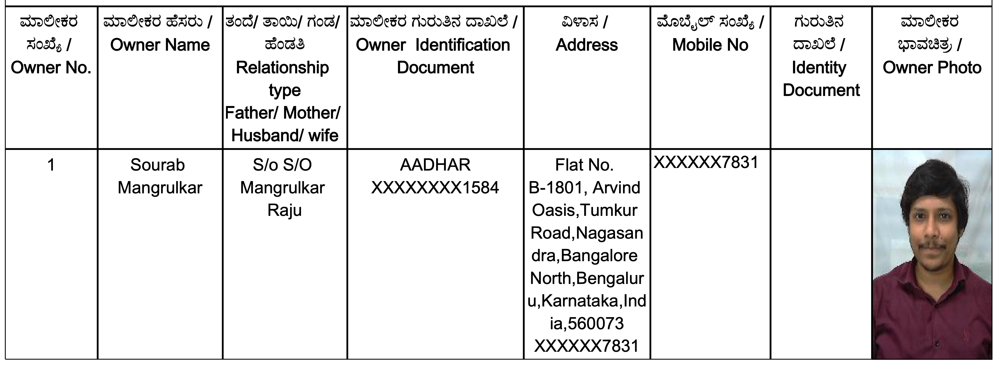

                                                 || जय श्री राम ||

## What is E-Khata?

Starting **October 1, 2024**, the **Bruhat Bengaluru Mahanagara Palike (BBMP)** has made **eKhata** a compulsory requirement for **property registration** and **title transfers**.
eKhata is the **digital version of the traditional Khata** and applies to both **A and B category properties**. It includes all the standard details present in a Khata Certificate and Extract, along with additional key information such as:

- Photograph of the property owner(s)  
- Photograph of the property  
- Geographical coordinates  
- Floor-wise area  
- Sale deed document number

Each eKhata document features a **barcode** that helps **verify authenticity** and **prevent fraudulent property transactions**.

If a **draft eKhata** for your property is already available, you can convert your Khata to eKhata via the official **BBMP eAasthi portal**:  
👉 [https://www.bbmpeaasthi.karnataka.gov.in/](https://www.bbmpeaasthi.karnataka.gov.in/)

Useful Resources and videos for the application process

1. ZenCitizen Portal - https://zencitizen.in/2024/10/04/what-to-expect-when-you-are-getting-an-ekhata/
2. BBMP Khata Video - https://www.youtube.com/watch?v=3dYNVJvAhBk
3. For name correction follow this - https://www.youtube.com/watch?v=HIyJuKUAoPY
4. Reddit Thread: https://www.reddit.com/r/bangalore/comments/1k4xnji/finally_i_got_ekhata_yesterday_costed_125/
5. How to Apply for (BBMP Final E-Khata) Step by Step Process in Kannada: https://youtu.be/mc6pM7z_oa8?si=H44O9V9xAMdPIqzr

## How to submit E-Khata Application?

### Login

When you go to [https://www.bbmpeaasthi.karnataka.gov.in/](https://www.bbmpeaasthi.karnataka.gov.in/), you will see the below login page.

Steps to **login**:
1. Enter your mobile phone number.
2. Click Fetch OTP
3. Enter the OTP received in the phone number.
4. Answer the Captcha which is a simple mathematical arithmetic operation.
5. Click Login

Once you login, you will see the below home page with various options on the left pane.

Click on **Get e-Khatha** option on the left pane. You will see the below page.

Enter the ward name. In my case it was `39`. Then, click on **Search** button. You will see the below page. I will click on the blue link for my ward **39- CHOKKASANDRA**. 

Now, you will see the **Property list**. In the **Search Type** box choose **Assessment No** and enter your Flat number in Search box, for me, it is **B-1801**. I see the below page.

Here, you will see all the details for your flat. Property ePID is unique indentifier for your property and is only available in the draft eKhata and is not information you would have beforehand. Owner name shows the current owner for the property as per the latest Khata. Here, I have already submitted my E-Khata and updated myself as the owner. Therefore, you can see owner name being **SOURAB MANGRULKAR**. In the **Download** tab I can download my E-Khata. The process for it is specified in section [How to Download the Approved E-Khata?](#how-to-download-the-approved-ekhata)

In this blogpost, I want to look at the case of previous owner or builder name being displayed as owner and how to submit E-Khata Application to get it corrected. Here, we assume that you have already done the Khata transfer process and possess the physical copy of Khata extract in your name. Below is an example where the owner is the builder (**Arvind Infracon LLP Rep By Mr. Deepak Manchanda**) of the property as the current owner.
. Here, click on the **Click Here** button in the column **Submit information for FINAL ekhata for correction in ekhata**. You will see the below page.

In next section, we will look at all the steps involved in filling out this form.

### E-Khatha Application form filling

#### SAS Details

First Section to fill is SAS Details. For this, you will need most recent **Property Tax** receipt. Choose the Property type as **Multistorey Flats**. Enter the Application number found at the top of Property Tax receipt in the filed **Enter SAS Property Tax 10-digit Application Number**. A sample Property Tax receipt section is shown below. Review the submitted information and retrieved details and press **Save & Next** button.

After you fill it, you should see something like below.

#### Kaveri Regrestration Details

In the section, choose **Registration Happened after 01.04.2004, then enter Registration Number** radio button. Enter the registration number found in your **Sale Deed** and click **Get Kaveri Document Data**. Review the retrieved details and press **Save & Next** button.

Below is the sample section of Sale Deed with the Registration Number masked with Red Box.

After you fill it, you should see something like below.

#### Khatadar Details (Owner Details)

Here, if it is displaying the previous owner or the Builder as the owner, choose the option to **Delete Name** them as the owner. Then click on add new Owner. Enter your Aadhar details and do the eKYC. You should see something like below. 

#### Apartment Details

Enter things like Built-Up Area, Carpet Area, Additional Area, Parking Availability, Parking Area, Owner share area as part of **undivided interest in the property**. All these details can be found in the Sale Deed. Enter the **Bescom Meter ID** and review those details. Below are details for my apartment.

#### Location of Property 

Search for the Apartment name in the Maps Search box and zoom the map and put the map pointer just above your apartment block to get the exact Longitude and Latitude details. Enter remaining details along with the photo of the property. The filled section should look like below.

. 

You can also confirm the coordinates via Google maps on your phone like below.

#### Classification Documents/ Proof of Property

Here, choose **eSwathu Form-9** option from the drop down and submit the scanned copy of Physical Khata Extract with you as owner.  Your khata Certificate's first page should look like below. Not that you should scan all the pages of the Khata Extract. This is required because you are changing book records to delete Builder as owner and update it with your as the owner.

After filling this section, it should like like below.

#### identification documents

Here, you will need Encumberance Certificate (EC). Enter the EC Application Number found at the top right as masked with red box below.

After filling this section, it should look like below.

#### Name Mismatch Reason Details

For Builder name and your name mismatches, choose **Sale/Transferred** as the reason from the drop down. For mismatch of your name in All Caps vs normal case, you can choose **Wrongly Mismatched** option.

#### Submit and Download Acknowledgement document

Now, review all the details, choose the final checkboxes and submit. Once submitted, download the acknowledgement document which looks like below.

## How to view the application status?

You can find the submitted application details in the **Submitted Property Status** on the left pane after you login to [https://www.bbmpeaasthi.karnataka.gov.in/](https://www.bbmpeaasthi.karnataka.gov.in/). It should look like below.

To check the status without logging, you can click the **Final eKhatha status based on ePID** on the home page of [https://www.bbmpeaasthi.karnataka.gov.in/](https://www.bbmpeaasthi.karnataka.gov.in/) and enter your ePID. You should see the status for your application.

## How to Download the Approved E-Khata?

Once approved, login to the [https://www.bbmpeaasthi.karnataka.gov.in/](https://www.bbmpeaasthi.karnataka.gov.in/) and click on **Get e-Khata** and follow the steps mentioned above at the start to locate your property. You should see **Previous Print/Latest Print** in the download section. Click on the **Latest Print** option. You will see the below page asking for payment of INR 125.

Do the payment using UPI and then download the E-Khata. The password for the downloaded E-Khata is the Property ePID. The E-Khata should look like below.

## Final Thoughts

I have tried to document my experience with this process and hopefully, it will help you too.
